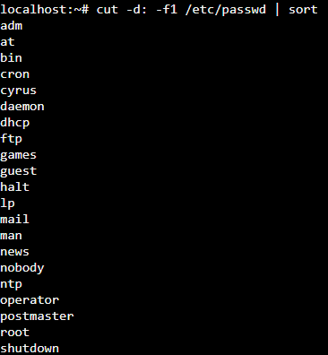

# Практическая работа №1
Студент: Бичуцкий Василий Алексеевич.
Группа: ИКБО-62-23

---

## Задание 1

Вывести отсортированный в алфавитном порядке список имен пользователей в файле passwd



## Задание 2

Вывести данные /etc/protocols в отформатированном и отсортированном порядке для 5 наибольших портов, как показано в примере ниже:


## Задание 3

Написать программу banner для вывода текстов, как в следующем примере (размер баннера должен меняться!

```python
letter = input()
letter_len = len(letter)
print("+-" + "-" * letter_len + "-+")
print("| " + letter + " |")
print("+-" + "-" * letter_len + "-+")
```


## Задание 4

Написать программу для вывода всех индентификаторов по (правилам C/C++ или Java) в файле (без повторений).

```bash
#!/bin/bash

grep -o -E '\b[_a-zA-Z][_a-zA-Z0-9]*\b' "$1" | sort -u | tr '\n' ' '

echo
```


## Задание 5

Написать программу для регистрации пользовательской команды (правильные права доступа и копирование в /usr/local/bin).

```bash
#!/bin/bash 

d="/usr/local/bin/$(basename "$file" .py)" 
file=$1 

if [ ! -f $file ]; then 
    echo "File $file not found" 
    exit 1 
fi 

cp $file $d 
chmod 755 $d 
```


## Задание 6

Написать программу для проверки наличия комментария в первой строке файлов с расширением c, js и py.

```bash
#!/bin/bash 

for file in *.c *.js *.py; do 
    line=$(head -n 1 "$file") 
    if [[ $line == "#"* || $line == "//"* || $line == "/*"* ]]; then 
        echo "$file: first line is comment" 
    else 
        echo "$file: first line IN NOT comment" 
    fi 
done
```


## Задание 7

Написать программу для нахождения файлов-дубликатов (имеющих 1 или более копий содержимого) по заданному пути (и подкаталогам).

```bash
#!/bin/bash 

declare -A hashes 

find_dublicates(){ 
    local dir=$1 

    for file in "$dir"/*; do 
        if [[ -f $file ]]; then 
            hash=$(md5sum $file | awk '{print $1}') 
            if [[ -n ${hashes[$hash]} ]]; then 
                echo "найдены дубликаты по содержанию:" 
                echo "${hashes[$hash]}" 
                echo "$file" 
                echo "          " 
            else 
                hashes[$hash]=$file 
            fi 
        elif [[ -d $file ]]; then 
            fund_dublicates $file 
        fi 
     done 
} 

find_dublicates "."
```


## Задание 8

Написать программу, которая находит все файлы в данном каталоге с расширением, указанным в качестве аргумента и архивирует все эти файлы в архив tar.

```bash
#!/bin/bash 

files=( $(find . -type f -name "*.$1") ) 

if [[ ${#files[@]} -eq 0 ]]; then 
    echo "Файлы с расширением .$1 не найдены." 
    exit 0 
fi  
tar -cvf "archive.tar" "${files[@]}" 

echo "Архив создан" 
```


## Задание 9

Написать программу, которая заменяет в файле последовательности из 4 пробелов на символ табуляции. Входной и выходной файлы задаются аргументами.

```bash
#!/bin/bash 

input_file=$1 
output_file=$2 

sed 's/    /\t/g' $input_file > $output_file 

if [[ $? -eq 0 ]]; then 
    echo "Замена завершена. Результат записан в '$output_file'." 
else 
    echo "Ошибка при замене." exit 1 
fi 
```


## Задание 10

Написать программу, которая выводит названия всех пустых текстовых файлов в указанной директории. Директория передается в программу параметром.

```bash
#!/bin/bash

if [ ! -d "$1" ]; then
    echo "Директория $1 не существует."
    exit 1
fi

find "$1" -type f -name "*.txt" -empty
```


